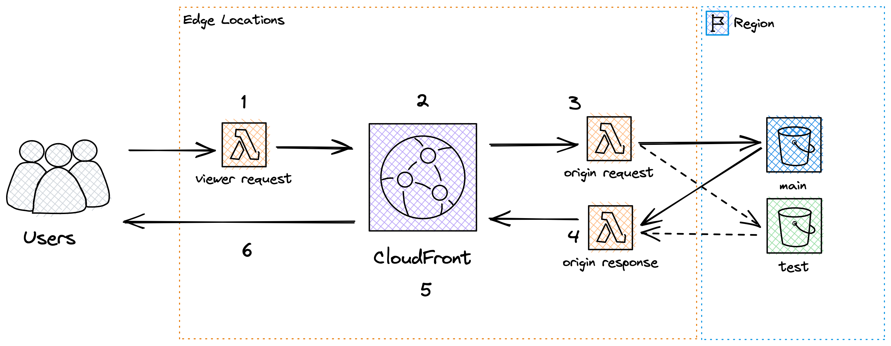

# CloudFront + Svelte

[Project Link](https://day0343nsogx7.cloudfront.net)

A CloudFront distribution serving _main_ and _test_ versions of a static website.

Under the hood:

1. Users make requests that are intercepted by the viewer request lambda. If the request contains our session cookie we forward the request to CloudFront, otherwise we randomly assign a cookie value of _main_ or _test_ in order to split site traffic.

2. Requests are cache hits if the site version cooresponding to the cookie is stored in CloudFront, in this case the site is promptly returned to the user. If CloudFront doesn't have the requested site version cached, it will trigger an origin request.

3. The origin request lambda checks the value of our cookie and based off of it will request one of our two origins (either _main_ or _test_). For this example each version of the site will get its own S3 bucket (recommended by AWS).

4. Our origin will respond with the appropriate version of the site. The origin response lambda will pass the value of the cookie (determined in step 1) back to the user and to CloudFront.

5. The cookie value (along with a path variable) is used as the cache key and will help to process all subsequent requests to CloudFront.

6. The cookie and path variable are returned to the user. The cookie gets stored in the browser's session storage and will ensure users recieve the same version of our site per every request (called _Sticky Sessions_)

## Tech Stack

**Client:** TypeScript, JavaScript, Svelte, HTML, CSS, Three.js

**Server:** AWS, CloudFront, Lambda, S3

## Features

- Custom vertex and fragment shaders make for a colorful background.
- A center button can be clicked to animate the background, makes use of Bezier Curve function to ease-in transition.
- Main version of site has blue font, test version has green font. You can manually set the cookie value to switch between versions.
- Github Actions workflow builds assets, uploads to S3, and invalidates CloudFront Cache so user requests always see latest version.

## Related

Some resources I found instrumental in helping with this project

[Lorenzo Nicora](https://dev.to/jimmydqv/cloudfront-deployments-with-lambda-edge-4jmh), [DevOps By Example](https://antonputra.com/amazon/deploy-react-to-s3-and-cloudfront/)
